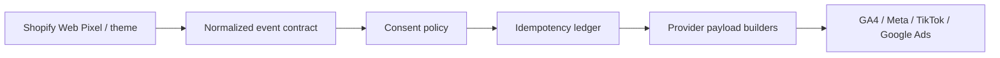

# Shopify First-Party Measurement Gateway

> A portfolio-grade reference implementation for consent-aware, server-side e-commerce event handling.

This repository demonstrates how a Shopify-style storefront can produce one normalized event contract and prepare provider-specific payloads for GA4, Meta, TikTok, and Google Ads. It is intentionally safe for public publication:

- no customer records, access tokens, pixel IDs, or ad-account IDs;
- no network calls to advertising platforms by default;
- fixtures and outputs are synthetic;
- provider adapters are payload builders that can be wired to real credentials later.

The project is an implementation exercise, not evidence of a production client deployment.

## Why this project matters

Shopify's Web Pixels API provides controlled access to browser APIs and customer events. Google's server-side tagging documentation highlights privacy controls and data quality, while GA4 Measurement Protocol supports server-side and offline events. This repository turns those ideas into a small, testable gateway rather than a collection of disconnected snippets.

## Architecture



## Supported event contract

The demo contract covers `page_view`, `view_item`, `add_to_cart`, `begin_checkout`, `add_payment_info`, and `purchase`.

Each accepted event carries:

- a stable `event_id` for deduplication;
- a `client_id` that is not a raw email or phone number;
- an ISO-8601 timestamp;
- a normalized event name;
- consent state for analytics and advertising use;
- commerce properties such as value, currency, item ID, and quantity.

Raw email and phone fields are rejected at the boundary. A real implementation would hash and transmit user data according to the relevant platform and legal policy.

## Run locally

The core implementation uses only the Python standard library.

```bash
PYTHONPATH=src python -m unittest discover -s tests -p 'test_*.py' -v
PYTHONPATH=src python -m measurement_gateway.server --port 8080
```

Send the included fixture to the local endpoint:

```bash
curl -X POST http://127.0.0.1:8080/events \
  -H 'Content-Type: application/json' \
  --data-binary @fixtures/purchase.json
```

## Repository map

```text
.
├── src/measurement_gateway/
│   ├── consent.py       # Consent-to-channel policy
│   ├── dedupe.py        # In-memory idempotency ledger
│   ├── gateway.py       # Ingestion and forwarding decision
│   ├── models.py        # Event contract and validation
│   ├── providers.py     # Test-mode provider payload builders
│   └── server.py        # Small standard-library HTTP adapter
├── examples/
│   ├── shopify-custom-pixel.js
│   └── theme.liquid
├── fixtures/purchase.json
├── tests/test_gateway.py
├── docs/
│   ├── provider-contracts.md
│   ├── privacy-and-consent.md
│   └── implementation-notes.md
└── .github/workflows/validate.yml
```

## What this proves — and what it does not

**Demonstrated in this repository:** event schema design, validation, consent gating, idempotency, provider payload mapping, Shopify-style event ingestion, Python backend structure, tests, and CI.

**Not claimed:** a live production connection to a merchant's Shopify admin, Meta CAPI, TikTok Events API, Google Ads account, or GA4 property. Those integrations require real credentials, consent configuration, and account-level verification.

## Author

**Syed Muslim Shah** — Technical Performance Marketer focused on acquisition testing, Shopify measurement, Pixel/CAPI diagnostics, and funnel analysis.
